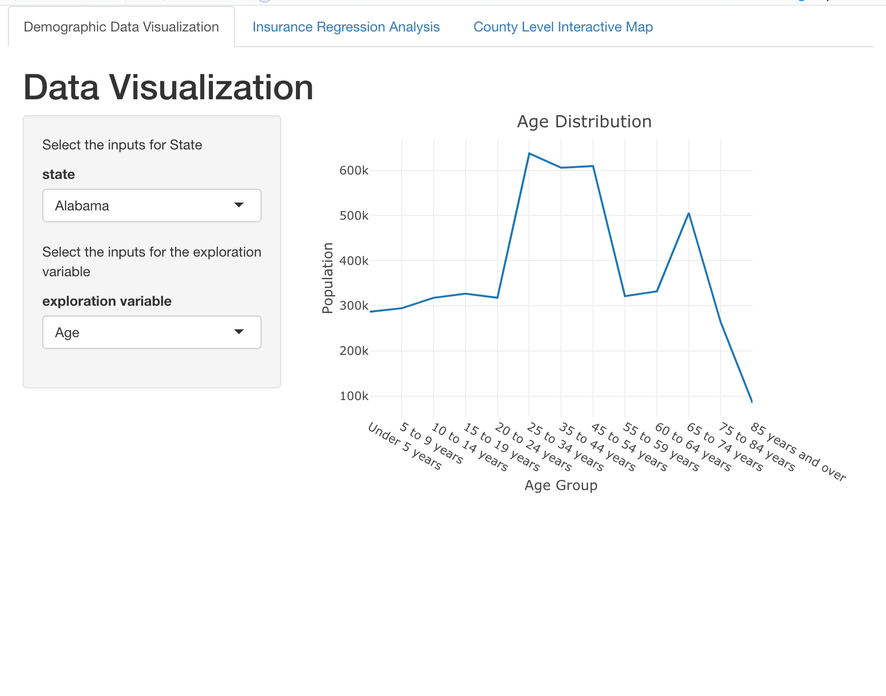
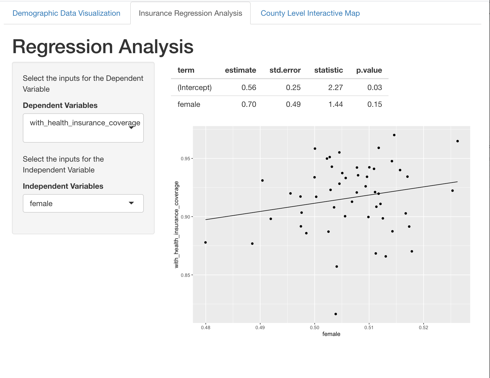
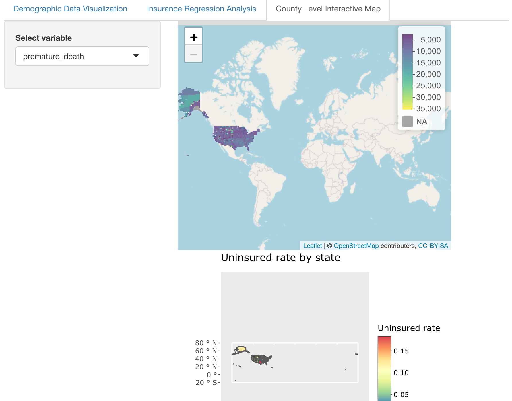

Introduction:
The main focus of this project is health insurance coverage in the United States. Specifically, we explore various factors that might influence the uninsured rate, and the potential impact of lacking health insurance coverage on people’s health condition. Our data is mainly from two sources: American Community Survey and the County Health Rankings & Roadmaps, a program of the University of Wisconsin Population Health Institute. This project is completed in Shiny App because we want our audience to directly manipulate the graphs and regressions based on their interests.  The project can be separated into two parts: data visualization and regression analysis. The Data visualization is displayed in tab 1 and 3,  including a list of interactive plots, county-level and state-level U.S. maps. The regression Analysis is stored in tab 2. All the dataset and source code can be downloaded from the Github page(). 
We acknowledge that there are many problems embedded in this project. We would like to explore more on the data visualization part in the future, specifically to increase the interactivity of the maps. We also want to refine the overall design of the app. 

{width=200}

Demographic Data Visualization:  

The first tab in the app explores the demographic data on the state level. Users are able to select the state and variable they would like to explore, and corresponding visualization will show up. 

To create the interactive plot, we used the library plotly. We wrote a function identifying the variables and its corresponding plots using few if statements, since the plot for each variable differs. The inputs for the function are the user's selection of variable name and state. Here is a sample line of code:

```{r, eval = FALSE}
state_visualization <- function(variable_name, input_state){
  if (variable_name == 'Uninsured_rate'){
    fig <- plot_ly(Total_state_2019, x = ~Total_state_2019$State, y = ~Total_state_2019$Uninsured_rate, type = 'bar', name = 'Uninsured rate', marker = list(color = 'rgb(49,130,189)'))
    
    fig <- fig %>% layout(title = 'Uninsured rate for each state',
                          xaxis = list(title = "", tickangle = -45),
                          yaxis = list(title = ""),
                          margin = list(b = 100),
                          barmode = 'group')
  }
return(fig)
}
```


The plot function is then put into renderPlotly. 

```{r, eval = FALSE}
output$ExpPlot <- renderPlotly(
  {state_visualization(input$ExpVar, input$state)}
)
```

{width=200}

Regression Analysis: 

The second tab plots linear regression analysis for insurance, and explores the relationship between different demographic variables and percent of people getting insurance.

We used a reformulate function inside a reactive function to create a reactive linear regression analysis. The result of the regression model is then both plotted and shown in a table. Here is the sample code. The input for dependent and independent variables are from user input. 

```{r, eval=FALSE}
lm1 <- reactive({lm(reformulate(input$IndVar, input$DepVar), data = percent)})

output$RegPlot <-  renderPlot(
  augment(lm1()) %>% 
    ggplot() +
    geom_jitter(aes(x=.data[[input$IndVar]], y=.data[[input$DepVar]])) +
    geom_line(aes(x=.data[[input$IndVar]], y=.fitted))
)
output$RegSum <- renderTable({tidy(lm1())})
```

{width=200}

Interactive Maps:
There are two interactive maps displayed in tab 3: a county-level interactive map and a state-level interactive map. We use the package leaflet to build the first county-level map. In this leaflet U.S. map,  users can choose different variables and see the distribution of the selected variables across the United States. The selected variables reflect multiple health problems. The plotly state-level U.S. map below displays the uninsured rate across all states in the U.S. By comparing the two maps, users can have a better sense of how health insurance coverage might impact on local health. 

```{r, eval = FALSE}
output$map <- renderLeaflet({
   
    pos <- match(input$variableselected, names(county_map_data))    
    pal <- colorNumeric("viridis", domain = county_map_data %>% pull(pos))
    popup_sb <- paste0("<b><h3>", county_map_data$county, sep = ": ", "</h3></b>", as.character(county_map_data %>% pull(pos)))
       leaflet(county_map_data) %>% 
      addTiles() %>% 
      addPolygons(
          stroke = FALSE, 
         fillColor = ~pal(county_map_data %>% pull(pos)), #~pal(total_population),
         fillOpacity = 0.7, 
         smoothFactor = 0.5, 
         highlight = highlightOptions(weight = 5, 
                                     color = "black",
                                     fillOpacity = 0.9,
                                     bringToFront = FALSE),
        popup=~popup_sb) %>% 
      leaflet::addLegend(
        pal = pal, values = ~county_map_data %>% pull(pos),
        opacity = 0.7, title = NULL
      ) })

output$g<-renderPlotly({
    g <- ggplot(state_map) +
      geom_sf(aes(map_id=State, fill=Uninsured_rate)) +
      scale_fill_distiller("Uninsured rate", palette="Spectral") +
      ggtitle("Uninsured rate by state")
    ggplotly(g)
  })
  

```

